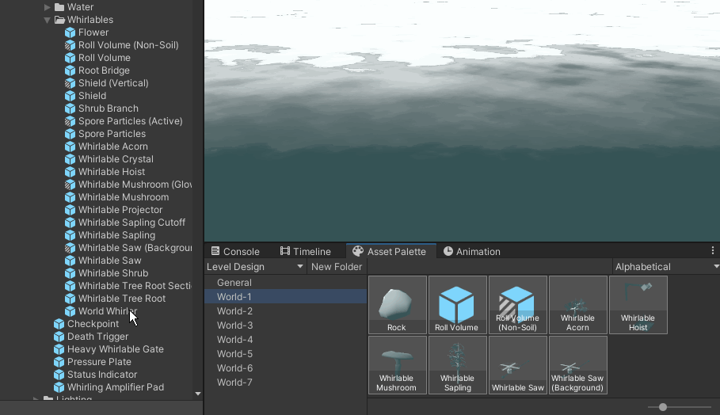

[](http://roytheunissen.com)
[](LICENSE.md)
 

_Allows you to quickly organize assets for certain workflows, such as organizing prefabs for level design._

## About the Project

I noticed that during game development there are certain workflows - such as level design - where you are making heavy use of a very small group of assets, such as all the props that belong to the level you're currently designing. It doesn't always make sense to put those assets in the same folder in your project, sometimes you want to make custom groups of assets regardless of where the files are in your project.

That's exactly what this tool is for.

Make custom groups of frequently used assets and shortcuts to folders for your project-specific workflows.

Also lets you turn static methods into macros that you can run at any time by double-clicking its icon.

[Video](https://www.youtube.com/watch?v=vlryRWGPMfI)    |    [Article](https://blog.roytheunissen.com/2022/07/07/introducing-the-asset-palette/)



## Getting Started

- Add the Asset Palette to your Unity project (tips on how to install it are in the Installation section)
- Open a new Asset Palette window via `Windows/General/Asset Palette`
- Create a new Asset Palette Collection asset. This is where your folders and asset shortcuts will be serialized to.

## Compatibility

It is recommended to be used in Unity 2021, though with a little help from [@Thundernerd](https://github.com/Thundernerd) it is now compatible with 2020 too.

If you want my help in supporting an even earlier version, feel free to reach out.

## Installation

### Package Manager

Go to `Edit > Project Settings > Package Manager`. Under 'Scoped Registries' make sure there is an OpenUPM entry.

If you don't have one: click the `+` button and enter the following values:

- Name: `OpenUPM` <br />
- URL: `https://package.openupm.com` <br />

Then under 'Scope(s)' press the `+` button and add `com.roytheunissen`.

It should look something like this: <br />


<br />
All of my packages will now be available to you in the Package Manager in the 'My Registries' section and can be installed from there.
<br />


### Git Submodule

You can check out this repository as a submodule into your project's Assets folder. This is recommended if you intend to contribute to the repository yourself.

### OpenUPM
The package is available on the [openupm registry](https://openupm.com). It's recommended to install it via [openupm-cli](https://github.com/openupm/openupm-cli).

```
openupm add com.roytheunissen.assetpalette
```

### Manifest
You can also install via git URL by adding this entry in your **manifest.json**
```
"com.roytheunissen.assetpalette": "https://github.com/RoyTheunissen/Asset-Palette.git"
```

### Unity Package Manager
```
from Window->Package Manager, click on the + sign and Add from git: https://github.com/RoyTheunissen/Asset-Palette.git
```


## Contact
[Roy Theunissen](https://roytheunissen.com)

[roy.theunissen@live.nl](mailto:roy.theunissen@live.nl)
